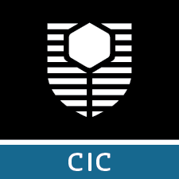
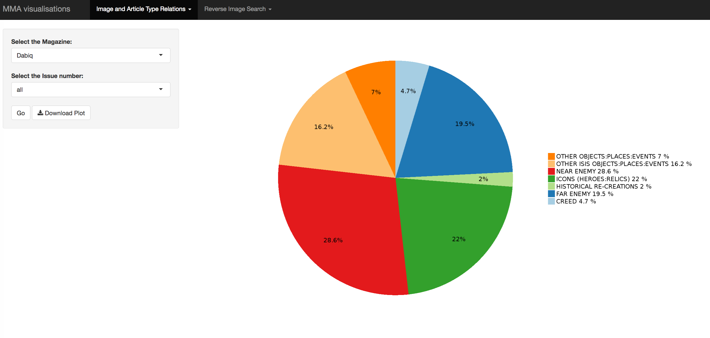

<section class="titleslide level1">
<h1>R Shiny</h1>
<h2>Customising data exploration apps for researchers</h2>
<p>
&nbsp;
&nbsp;
&nbsp;
</p>

 [**Rebecca Lange**](mailto:rebecca.lange@curtin.edu.au)

<span style="color:#2e96c6">**Curtin Institute for Computation**</span>

<small>
18 October 2018 - eResearch Astralasia
</small>



</section>
# What is R?

## What is R?^<small>[1](https://www.r-bloggers.com/extending-accessibility-of-open-source-statistical-software-to-the-masses-a-shiny-case-study/)</small>^

R is an open source statistical programming language.
<p>
&nbsp;
&nbsp;
&nbsp;
</p>
- Common statistical procedures are found in R
- Can extend functionality with packages/functions
- Open Source, backed by a growing community
- High-level language, code is readable
- Scalable
- Reproducible


## Why use R in research?^<small>[1](https://www.r-bloggers.com/extending-accessibility-of-open-source-statistical-software-to-the-masses-a-shiny-case-study/)</small>^
<p>
&nbsp;
&nbsp;
</p>

**Pros**

- Common statistical procedures are found in R
- Can extend functionality with packages/functions
- Open Source, backed by a growing community
- High-level language, code is readable
- Scalable
- Reproducible

*R is powerful and flexible due to the many user written packages.*

**Cons**

- users need to be comfortable with programming
- users need to find the package
- users need to understand package specific syntax


# What is Shiny?

## What is Shiny?^<small>[2](https://www.rstudio.com/products/shiny/)</small>^

<video width="480" controls loop autoplay>
  <source src="shiny_example.mp4" type="video/mp4">
</video>


Shiny is an **open source R package** that provides an elegant and powerful web framework for building web applications using R. 

Shiny helps you turn your analyses into **interactive web applications** without requiring HTML, CSS, or JavaScript knowledge.


## Why use Shiny for research?^<small>[1](https://www.r-bloggers.com/extending-accessibility-of-open-source-statistical-software-to-the-masses-a-shiny-case-study/)</small>^

**Pro**

- User needs no R knowledge
- App is viewed in the browser so able to use
    - Javascript
    - HTML
    - CSS
- Multiple hosting options
- Flexible Output

**Cons/Difficulties**

- Need a R developer to create the app.
    - More difficult as the code is somewhat different compared to traditional R code.
    - Shiny uses reactive programming.

## Components of Shiny

- User Interface (ui.r)
    - What the user sees and interacts with
    
```r
# Define UI for application that draws a histogram
shinyUI(fluidPage(
  
  # Application title
  titlePanel("Old Faithful Geyser Data"),
  
  # Sidebar with a slider input for number of bins 
  sidebarLayout(
    sidebarPanel(
       sliderInput("bins",
                   "Number of bins:",
                   min = 1,
                   max = 50,
                   value = 30)
    ),
    
    # Show a plot of the generated distribution
    mainPanel(
       plotOutput("distPlot")
    )
  )
))
```

## Components of Shiny

- R Analysis (server.r)
    - The R code running behind the scenes
    
```r
# Define server logic required to draw a histogram
shinyServer(function(input, output) {
   
  output$distPlot <- renderPlot({
    
    # generate bins based on input$bins from ui.R
    x    <- faithful[, 2] 
    bins <- seq(min(x), max(x), length.out = input$bins + 1)
    
    # draw the histogram with the specified number of bins
    hist(x, breaks = bins, col = 'darkgray', border = 'white')
    
  })
  
})

```


# Live Demo examples

## Temples across South East Asia

A Shiny app built to share and explore data generated from a study of temple architectures across south-east Asia.

[](https://shiny.computation.org.au/TempleArchive/)

## MMA group data explortion app

A Shiny app developed to support the Multimodal Analysis Group at Curtin University in their study of Online Extremist Communications.

[](https://shiny.computation.org.au/MMAv0.2/)

</section>

## Links

1. https://www.r-bloggers.com/extending-accessibility-of-open-source-statistical-software-to-the-masses-a-shiny-case-study/
2. https://www.rstudio.com/products/shiny/
<p>
&nbsp;
&nbsp;
&nbsp;
</p>

Temple exploration app  
https://shiny.computation.org.au/TempleArchive/

Extremist Discourse Exploration app  
https://shiny.computation.org.au/MMAv0.2/
<p>
&nbsp;
&nbsp;
&nbsp;
</p>

Further reading  
https://shiny.rstudio.com/articles/basics.html
http://shiny.rstudio.com/gallery/
